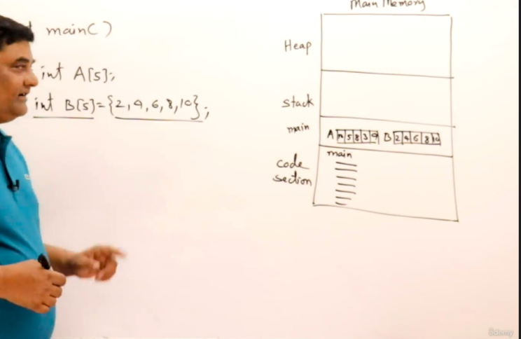

# Basics in C & C++

## Arrays

An array is a collection of similar data elements stored at contiguous memory locations. It is the simplest data structure where each data element can be accessed directly by only using its index number.

For instance, if we want to store the marks scored by a student in 5 subjects, then there’s no need to define individual variables for each subject. Rather, we can define an array that will store the data elements at contiguous memory locations.

Array marks[5] define the marks scored by a student in 5 different subjects where each subject’s marks are located at a particular location in the array, i.e., marks[0] denote the marks scored in the first subject, marks[1] denotes the marks scored in 2nd subject and so on.

```c++
int a[5]; /* Initializing the array*/ 
int b[5] = {2,3,4,5,6}; /*Declaration of array*/
```

When ever we initialize the array its going to store in main memory.



## Why we need to deallocate the memory?

Deallocating memory is crucial for several reasons, particularly in C++ and other languages where memory management is manual. Here's why deallocating memory is important:

### 1. Prevent Memory Leaks

**Memory Leaks**: When dynamically allocated memory is not properly deallocated, it remains allocated even when it is no longer needed. This leads to memory leaks, where the application consumes more and more memory over time, potentially exhausting system resources and causing the application to crash or slow down significantly.

### 2. Efficient Use of Resources

**Resource Management**: Efficiently managing memory resources is essential for the performance and stability of an application. Deallocating memory when it is no longer needed ensures that the memory can be reused for other parts of the application or by other applications running on the system.

### 3. Avoiding Undefined Behavior

**Memory Corruption**: Failing to deallocate memory can also lead to undefined behavior if the program inadvertently writes to memory that it thinks is still valid. This can corrupt data, cause crashes, and lead to difficult-to-debug issues.

### 4. Compliance with RAII (Resource Acquisition Is Initialization) Principle

**RAII**: This is a common idiom in C++ programming. It ensures that resources are properly released when they are no longer needed. By following RAII, you create robust and exception-safe code. Using destructors to deallocate memory is a key part of this principle.

> We need to manually deallocate the memory in C/C++. In Java, Python, Go, C# no need for manual deallocation. In Rust memory is automatically deallocated when the variable goes out of scope

## Out of scope example

```c
#include <iostream>

void exampleFunction() {
    int localVariable = 10; // localVariable is in scope
    std::cout << "Inside function: " << localVariable << std::endl;
}   // localVariable goes out of scope here

int main() {
    exampleFunction();
    // localVariable is not accessible here, it's out of scope
    return 0;
}
```

### Practical Example with Destructor

To illustrate the importance of deallocating memory, consider a simple example with a class that dynamically allocates memory:

```cpp
#include <iostream>

class Rectangle {
private:
    int* length;
    int* breadth;

public:
    // Constructor
    Rectangle(int l, int b) {
        length = new int;  // Allocate memory for length
        breadth = new int; // Allocate memory for breadth
        *length = l;
        *breadth = b;
    }

    // Destructor
    ~Rectangle() {
        delete length;  // Deallocate memory for length
        delete breadth; // Deallocate memory for breadth
        std::cout << "Destructor called, memory deallocated" << std::endl;
    }

    // Function to calculate the area
    int area() const {
        return (*length) * (*breadth);
    }

    // Function to display the dimensions
    void display() const {
        std::cout << "Length: " << *length << ", Breadth: " << *breadth << std::endl;
    }
};

int main() {
    Rectangle* rect = new Rectangle(10, 5);

    rect->display();
    std::cout << "Area of the rectangle: " << rect->area() << std::endl;

    delete rect; // Manually deleting the object to invoke the destructor and deallocate memory

    return 0;
}
```

### Explanation

1. **Constructor**: Allocates memory for `length` and `breadth` dynamically.
2. **Destructor**: Deallocates the memory to prevent memory leaks.
3. **Creating and Deleting Object**: In `main`, the `Rectangle` object is created using `new`, and manually deleted using `delete`. This ensures that the destructor is called, which deallocates the memory.

### Summary

Deallocating memory in C++ is a critical part of managing resources efficiently. It prevents memory leaks, ensures that resources are available for other uses, and maintains the stability and performance of the application. The use of destructors to handle deallocation is a standard practice that aligns with the RAII principle, making your code more robust and maintainable.

## Structures

Structures (also called struct) are a way to group several related variables into one place. Each variable in the structure is known as a member of the structure.
Unlike an array, a structure can contain many different data types (int, float, char, etc.).

- Collection of data members under one name is structure
- Data members can be of similar type or non similar type
- When structures is called in the main( ) program then it will consume space accordingly to the data members types it contains in the memory.
- An example of structure is a program of a rectangle

```c++
Struct Rectangle
{
int length;
int breath;
}

int main()
{
struct Rectangle r ;            - Declaration
Struct Rectangle r = { 10, 5 }; - Declaration + Initialization
r.length = 15 ;                 - ( . operator ) Is is used to access a members to modify
r.breath = 10 ;
Printf( “ Area of rectangle is %d” , r.length * r.breath ) ; - Accessing the members
}
```

## Use of structure

Structures is used to combine data under one name, thus some example usage of structures is:

- In Complex numbers
- In student details
- In Employee Details
- Bank Details etc
- Defining Shapes etc…

> In the example, We get the size of the struct as 12 instead of 9 as integers take 4 bytes each and char takes 1 byte. But instead, the compiler takes 4 bytes as it's easy for the compiler to read but fur char it assigns only 1 byte from the four. This is called `padding` as it takes more bytes other than what is required.

## Pointers

- Pointer is an address variable that is meant for storing an address, not data itself.
- They are used for indirect access to data.
- For a program to use heap memory, pointers are used.
- To access heap memory and resources outside the main memory like the internet, keyboard, monitor, etc pointers is used. Pointers are also used for parameter passing.

Example :

```c++
int main( )
{
Int a = 10 ;             - data variable
Int *p ;                 - declaration
P = &a ;                 - Assignment / Initialization
printf(“%d ” , a );    
printf(“%d ” , *p) ;     - dereferencing
}
```

## Accessing Heap memory through pointer

```c++
int main( )
{
Int *p;
// p = (int*)malloc(5*sizeof(int)); in c
P = new int[5]; // in C++
}
```

## Memory

When a program is assigned the memory its basically divided into three parts

- code section
- stack memory
- heap memory

The program will have access to stack & code section but won't have access to the heap memory. To access the heap memory we use pointer.

### uses of pointer

- Accessing Heap memory
- Accessing resources
- parameter passing

## de·ref·er·ence

Obtain from (a pointer) the address of a data item held in another location.

```c++
#include <stdio.h>

int main() {
    int a = 10;      // Declare and initialize an integer variable
    int *p;          // Declare a pointer to an integer

    p = &a;          // Initialize the pointer to the address of 'a'
    
    printf("%d\n", a);  // Print the value of 'a'
    printf("%d\n", *p); // Dereference the pointer to print the value at the address stored in 'p'
    
    return 0;        // Return 0 to indicate successful execution
}

```

## Accessing Heap memory

In C, dynamic memory allocation for accessing memory in the heap is typically done using the standard library functions `malloc`, `calloc`, `realloc`, and `free`. These functions are declared in the `stdlib.h` header file. Here's a brief explanation of each function and how they are used:

### 1. `malloc`

The `malloc` function allocates a block of memory on the heap of a specified size and returns a pointer to the beginning of the block.

**Formula:**

```c
ptr = (cast_type *) malloc(size_in_bytes);
```

**Example:**

```c
int *p = (int *)malloc(10 * sizeof(int)); // Allocates memory for an array of 10 integers
```

### 2. `calloc`

The `calloc` function allocates memory for an array of elements, initializes them to zero, and returns a pointer to the memory.

**Formula:**

```c
ptr = (cast_type *) calloc(num_elements, size_of_each_element);
```

**Example:**

```c
int *p = (int *)calloc(10, sizeof(int)); // Allocates and initializes memory for an array of 10 integers
```

### 3. `realloc`

The `realloc` function changes the size of the previously allocated memory block.

**Formula:**

```c
ptr = (cast_type *) realloc(ptr, new_size_in_bytes);
```

**Example:**

```c
p = (int *)realloc(p, 20 * sizeof(int)); // Resizes the previously allocated memory to hold 20 integers
```

### 4. `free`

The `free` function deallocates the previously allocated memory, releasing it back to the heap.

**Formula:**

```c
free(ptr);
```

**Example:**

```c
free(p); // Frees the memory previously allocated to the pointer p
```

### Complete Example

Here’s a complete example demonstrating the use of these functions:

```c
#include <stdio.h>
#include <stdlib.h>

int main() {
    int *p;

    // Allocate memory for 10 integers
    p = (int *)malloc(10 * sizeof(int));
    if (p == NULL) {
        printf("Memory allocation failed\n");
        return 1;
    }

    // Use the allocated memory
    for (int i = 0; i < 10; i++) {
        p[i] = i * 10;
    }

    // Print the allocated memory
    for (int i = 0; i < 10; i++) {
        printf("%d ", p[i]);
    }
    printf("\n");

    // Reallocate memory for 20 integers
    p = (int *)realloc(p, 20 * sizeof(int));
    if (p == NULL) {
        printf("Memory reallocation failed\n");
        return 1;
    }

    // Use the reallocated memory
    for (int i = 10; i < 20; i++) {
        p[i] = i * 10;
    }

    // Print the reallocated memory
    for (int i = 0; i < 20; i++) {
        printf("%d ", p[i]);
    }
    printf("\n");

    // Free the allocated memory
    free(p);

    return 0;
}
```

### Key Points

- Always check if `malloc`, `calloc`, or `realloc` returns `NULL`, which indicates that the memory allocation failed.
- After using the allocated memory, always free it using the `free` function to avoid memory leaks.

## Reference

- A reference is a just another name for the same the variable
- Reference are only available in C++

## Example

```c++
#include <iostream>

int main() {
    int a = 10;          
    int &r = a;          // Reference to 'a'

    std::cout << a << std::endl; // Output the value of 'a'
    r++;                 // Increment the value of 'a' through the reference 'r'
    std::cout << r << std::endl; // Output the incremented value through 'r'
    std::cout << a << std::endl; // Output the incremented value of 'a'

    int b = 30;          // Correcting missing semicolon
    r = b;               // Assigning 'b' to 'a' through reference 'r'
    std::cout << a << std::endl << r << std::endl; // Output the new value of 'a' and 'r', both should be 30

    return 0;            // Return 0 to indicate successful execution
}

```

- This is use for parameter passing
- For writing small functions we use reference

## Pointer to a Structure

### Syntax - 1

- When variable is already existing , then we can use pointer to structure like

```c++
#include <stdio.h>

// Define a struct named Rectangle
struct Rectangle {
    int length;
    int breadth;
};

int main() {
    // Declare and initialize a Rectangle struct variable 'r'
    struct Rectangle r = {10, 5}; 

    // Declare a pointer to a Rectangle struct and assign it the address of 'r'
    struct Rectangle *p = &r;

    // Modify the length of 'r' directly
    r.length = 15;  
    printf("%d\n", r.length); // Output the modified length of 'r'

    // Modify the length of 'r' using the pointer 'p' with dereferencing
    (*p).length = 20;
    printf("%d\n", (*p).length); // Output the modified length of 'r' using dereferencing

    // Modify the length of 'r' using the pointer 'p' with the arrow operator
    p->length = 25;
    printf("%d\n", p->length); // Output the modified length of 'r' using the arrow operator

    return 0; // Return 0 to indicate successful execution
}
```

### Syntax - 2

- Dynamically object created in heap and pointer pointing there

```c++
#include <stdio.h>
#include <stdlib.h>

struct Rectangle {
    int length;
    int breadth;
};

int main() {
    struct Rectangle *p;

    // Allocate memory for a Rectangle structure in C
    p = (struct Rectangle *)malloc(sizeof(struct Rectangle));
    //Rectangle *p = new Rectangle;

    if (p == NULL) {
        printf("Memory allocation failed\n");
        return 1; // Return with an error code if memory allocation fails
    }

    // Assign values to the structure members
    p->length = 10;
    p->breadth = 5;

    // Print the values of the structure members
    printf("The length: %d & the breadth: %d\n", p->length, p->breadth);

    // Free the allocated memory
    free(p);

    return 0;
}

```

## Functions

- Function is a piece of code which performs a specific task
- Grouping instructions is called function
- They are called as modules or procedures
- The main task can be divided into several small task in the form of functions this type of programming is also called as modular or procedural programming
- It is easy for development
- A group of programmers can work on a single project using functioning
- Functions provide reusability of code
- It can be used in other software projects as well
- you can group function into library

Example :

```c++
#include<stdio.h>

int add( int a , int b ) /* Actual parameters */
{
    int c;
    c = a + b;
    return c;
}

int main ( )
{
    int x,y,z;
    x =10;
    y = 5;
    z = add (x,y); /* Formal parameters */
    printf("The sum of two number is: %d",z);
}
```

## Parameter Passing Methods

Your explanation of the different parameter passing mechanisms in C and C++ is clear. Here's a polished version of your examples, with additional comments for clarity.

### Pass/Call by Value

In pass by value, the actual parameters will not be modified if any changes are done to the formal parameters.

```c
#include <stdio.h>

// This function attempts to swap the values of x and y
void swap(int x, int y) {
    int temp;
    temp = x;
    x = y;
    y = temp;
}

int main() {
    int a, b;
    a = 10;
    b = 20;

    // Call the swap function
    swap(a, b);

    // Print the values of a and b after the swap function call
    printf("%d %d\n", a, b); // Output will be 10 20, not 20 10

    return 0;
}
```

### Call by Address

In call by address, the addresses of the actual parameters are passed to the formal parameters, which must be pointers. Any changes done inside the function will modify the actual parameters.

```c
#include <stdio.h>

// This function swaps the values of the integers pointed to by x and y
void swap(int *x, int *y) {
    int temp;
    temp = *x;
    *x = *y;
    *y = temp;
}

int main() {
    int a, b;
    a = 10;
    b = 20;

    // Call the swap function, passing the addresses of a and b
    swap(&a, &b);

    // Print the values of a and b after the swap function call
    printf("%d %d\n", a, b); // Output will be 20 10

    return 0;
}
```

- One function cannot access the value of another function directly, but it can access it indirectly through pointers.
- Thus, call by address is a suitable mechanism for modifying actual parameters.

### Call by Reference

References are part of C++ programming. It's one of the useful and powerful mechanisms of this language. To make a function call by reference, we just need to add `&` in the parameters. These are the references.

```cpp
#include <iostream>

// This function swaps the values of x and y using references
void swap(int &x, int &y) {
    int temp;
    temp = x;
    x = y;
    y = temp;
}

int main() {
    int a, b;
    a = 10;
    b = 20;

    // Call the swap function
    swap(a, b);

    // Print the values of a and b after the swap function call
    std::cout << a << " " << b << std::endl; // Output will be 20 10

    return 0;
}
```

- In C++, references provide a powerful mechanism for directly modifying the actual parameters without needing pointers.

### summary

- **Pass by Value:** Copies of the actual parameters are passed. Changes in the function do not affect the originals.
- **Call by Address:** Addresses of the actual parameters are passed. The function can modify the originals through pointers.
- **Call by Reference:** References to the actual parameters are passed (C++ only). The function can modify the originals directly.

## Arrays as Parameters

- The following function is taking parameter as an array, `int A[ ]` the declared array must be empty and its size must be provides as follows `int n`.
- The reason for array in parameter being empty is because it acts as a pointer.
- Arrays cannot be passed as values , arrays can only be passed by address.
- As its call by address its possible to change the values of the arrays.

```c++
#include <stdio.h>

// Function to modify array elements
void modifyArray(int A[], int n) {
    int i;
    for (i = 0; i < n; i++) {
        A[i] = A[i] * 2; // Modify each element of the array
    }
}

// Function to print array elements
void printArray(int A[], int n) {
    int i;
    for (i = 0; i < n; i++) {
        printf("%d ", A[i]); // Print each element of the array
    }
    printf("\n"); // Print newline for better readability
}

int main() {
    int A[5] = {1, 2, 3, 4, 5}; // Initialize array
    int n = 5; // Size of the array

    printf("Original array: ");
    printArray(A, n); // Print original array

    modifyArray(A, n); // Modify array elements

    printf("Modified array: ");
    printArray(A, n); // Print modified array

    return 0; // Return 0 to indicate successful execution
}

```

## Structure as Parameter

When sending a structure as a parameter to a function, it can be done by value or by address.

### Call by Value

- When passing a structure by value, a separate object is created, and all members are copied.
- Modifying the formal parameter does not affect the actual parameter.

```c
#include <stdio.h>

struct Rectangle {
    int length;
    int breadth;
};

// Function to calculate the area of the rectangle
int area(struct Rectangle r1) {
    return r1.length * r1.breadth;
}

int main() {
    struct Rectangle r = {10, 5}; // Initialize a Rectangle structure
    printf("%d\n", area(r)); // Call area function with the structure passed by value
    return 0; // Return 0 to indicate successful execution
}
```

In the above example, the `area` function takes a `Rectangle` structure by value. Any changes made to `r1` inside the function do not affect the original structure `r` in the `main` function.

### Call by address

- When passing a structure by address, the function receives a pointer to the structure.
- Modifying the structure via the pointer affects the original structure.

```c
#include <stdio.h>

struct Rectangle {
    int length;
    int breadth;
};

// Function to modify the dimensions of the rectangle
void modify(struct Rectangle *r1) {
    r1->length = 20;
    r1->breadth = 10;
}

int main() {
    struct Rectangle r = {10, 5}; // Initialize a Rectangle structure
    modify(&r); // Call modify function with the structure passed by address
    printf("Length: %d, Breadth: %d\n", r.length, r.breadth); // Output modified dimensions
    return 0; // Return 0 to indicate successful execution
}
```

In the above example, the `modify` function takes a pointer to a `Rectangle` structure. Changes made to the structure via the pointer affect the original structure `r` in the `main` function.

> Key Points

- **Call by Value:** A separate copy of the structure is created, and changes to the formal parameter do not affect the actual parameter.
- **Call by Address:** A pointer to the structure is passed, allowing the function to modify the original structure.
- If you want some function to change the actual parameter then it must be done by call by address or call by reference.
- It is possible to send array as a parameter in pass by value only if its inside the structure , if its just array passing then its not possible by pass by value.

## Call by reference

In call by reference, a reference to the actual parameter is passed to the function. This means the function works with the original variable, not a copy. Any changes made to the parameter inside the function will affect the actual parameter.

```cpp
#include <iostream>

using namespace std;

struct Rectangle {
    int length;
    int breadth;
};

int area(struct Rectangle &r1) {
    return r1.length * r1.breadth;
}

int main() {
    struct Rectangle r = {10, 5};
    cout << area(r) << endl;

    return 0;
}
```

- The only change we need to do for call by reference is adding `&` in the parameter.
- Here the new object is not created but the same object is called `r1` also.
- Thus new changes in the values will affect the actual parameters.

## Structure & Functions in C

```c++
#include<stdio.h>

struct Rectangle
{
    int length;
    int breadth;
}; // Intializing the structure

void initialize(struct Rectangle *r,int l,int b)
{
    r->length = l;
    r->breadth = b;
}

int area( struct Rectangle r)
{
    return r.length*r.breadth;
}

void changelength(struct Rectangle *r, int l)
{
    r->length = l;
    printf("The length has been modified to: %d\n",r->length);
}

int main()
{
    struct Rectangle r;
    initialize(&r,10,5);
    printf("The area of a rectangle: %d\n",area(r));
    changelength(&r,20);
    return 0;
}
```

## Object Oriented Programming using `struct`

```c++
#include <stdio.h>
#include <iostream>

using namespace std;

struct Rectangle {
    int length;
    int breadth;

    void initialize(int l, int b) {
        length = l;
        breadth = b;
    }

    int area() {
        return length * breadth;
    }

    int perimeter() {
        return 2 * (length + breadth);
    }
};

int main() {
    Rectangle r = {0, 0};
    int l, b;
    
    printf("Enter the length & breadth: ");
    cin >> l >> b;
    // cin>>r.length>>r.breadth; Can also initialize like this or create a function for initialization

    // Initialize the rectangle using the initialize function
    r.initialize(l, b);

    // Calculate the area and perimeter
    int a = r.area();
    int peri = r.perimeter();

    // Print the area and perimeter
    printf("The area of the rectangle is: %d & the perimeter of the rectangle is: %d\n", a, peri);

    return 0;
}

```

## Complete Object-Oriented Programming using `class`

To convert the previous OOP-style `struct` to a fully encapsulated `class`, we need to use the `class` keyword instead of `struct`. Additionally, we'll declare the member functions and variables as `public` or `private` to control access. By default, members of a `class` are private, so we need to explicitly specify which members are public.

Here is the converted version:

```cpp
#include <iostream>
using namespace std;

class Rectangle {
private:
    int length;
    int breadth;

public:
    void initialize(int l, int b) {
        length = l;
        breadth = b;
    }

    int area() {
        return length * breadth;
    }

    int perimeter() {
        return 2 * (length + breadth);
    }
};

int main() {
    Rectangle r;
    int l, b;
    
    cout << "Enter the length & breadth: ";
    cin >> l >> b;

    // Initialize the rectangle using the initialize function
    r.initialize(l, b);

    // Calculate the area and perimeter
    int a = r.area();
    int peri = r.perimeter();

    // Print the area and perimeter
    cout << "The area of the rectangle is: " << a << " & the perimeter of the rectangle is: " << peri << endl;

    return 0;
}
```

### Key Point

- **Class Definition:**
  - The `Rectangle` class now includes `private` members for `length` and `breadth`, ensuring encapsulation.
  - The `public` keyword is used to make the member functions accessible from outside the class.

- **Initialization:**
  - The `initialize` function sets the `length` and `breadth` of the rectangle.

- **Area Calculation:**
  - The `area` function returns the area of the rectangle.

- **Perimeter Calculation:**
  - The `perimeter` function returns the perimeter of the rectangle.

- **Main Function:**
  - The `main` function demonstrates creating a `Rectangle` object, initializing it, and using its member functions to calculate and display the area and perimeter.

This example demonstrates how to use the `class` keyword to create a fully encapsulated object in C++, adhering to the principles of object-oriented programming.

## Class & Constructor

- **Mutator Functions:** Functions that modify the values of private data members. In this example, `setLength` and `setBreadth` are mutator functions.
- **Accessor Functions:** Functions that access the values of private data members without modifying them. In this example, `getLength` and `getBreadth` are accessor functions.

```cpp
#include <iostream>
using namespace std;

class Rectangle {
private:
    int length;
    int breadth;

public:
    // Default constructor
    Rectangle() {
        length = breadth = 1;
    }

    // Parameterized constructor
    Rectangle(int l, int b) {
        length = l;
        breadth = b;
    }

    // Method to calculate area
    int area() {
        return length * breadth;
    }

    // Method to calculate perimeter
    int perimeter() {
        return 2 * (length + breadth);
    }

    // Mutator function to set length
    void setLength(int l) {
        length = l;
    }

    // Mutator function to set breadth
    void setBreadth(int b) {
        breadth = b;
    }

    // Accessor function to get length
    int getLength() {
        return length;
    }

    // Accessor function to get breadth
    int getBreadth() {
        return breadth;
    }

    // Destructor
    ~Rectangle() {
        cout << "Destructor called" << endl;
    }
};

int main() {
    // Create a rectangle object using the parameterized constructor
    Rectangle r{10, 5};

    // Display area and perimeter
    cout << "Area: " << r.area() << endl;
    cout << "Perimeter: " << r.perimeter() << endl;

    // Display current length and breadth
    cout << "Length: " << r.getLength() << endl;
    cout << "Breadth: " << r.getBreadth() << endl;

    // Modify length and breadth using mutator functions
    r.setLength(20);
    r.setBreadth(30);

    // Display modified length and breadth
    cout << "Modified Length: " << r.getLength() << endl;
    cout << "Modified Breadth: " << r.getBreadth() << endl;

    // Display updated area and perimeter
    cout << "Updated Area: " << r.area() << endl;
    cout << "Updated Perimeter: " << r.perimeter() << endl;

    return 0;
}
```

> Key Points

- **Default Constructor:** Initializes length and breadth to 1.
- **Parameterized Constructor:** Initializes length and breadth with given values.
- **Destructor:** Prints a message when the object is destroyed.
- **Mutator Functions:** `setLength` and `setBreadth` modify the length and breadth of the rectangle.
- **Accessor Functions:** `getLength` and `getBreadth` return the current values of length and breadth without modifying them.

## Templates Class

A template is a simple yet powerful tool in C++. The idea is to pass the data type as a parameter so that we don’t need to write the same code for different data types. For example, a software company may need a `sort()` function for different data types. Rather than writing and maintaining multiple codes, we can write one `sort()` function and pass the data type as a parameter.

C++ adds two keywords to support templates: `template` and `typename`. The second keyword can always be replaced by the keyword `class`.

```cpp
#include <iostream>
using namespace std;

// One function works for all data types. This would work
// even for user-defined types if the operator '>' is overloaded
template <typename T>
T myMax(T x, T y) {
    return (x > y) ? x : y;
}

int main() {
    // Call myMax for int
    cout << myMax(3, 7) << endl;
    // Call myMax for double
    cout << myMax(3.0, 7.0) << endl;
    // Call myMax for char
    cout << myMax('g', 'e') << endl;

    return 0;
}
```
