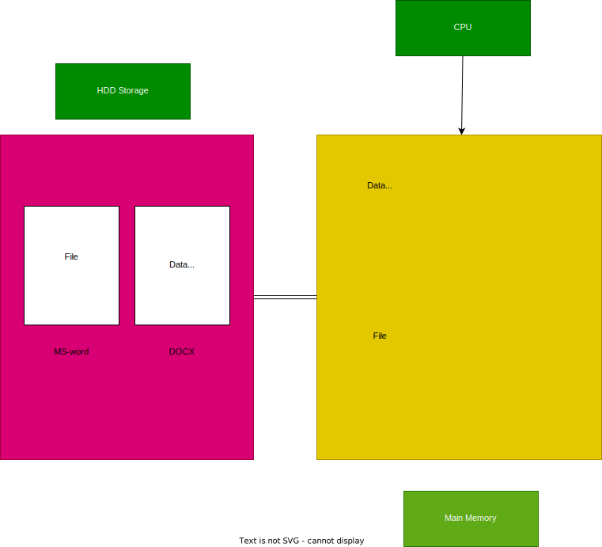

# Introduction to Data Structures

## What is a Data Structure?

A data structure is a way of organizing and storing data in a computer so that it can be accessed and modified efficiently. The organization of data in main memory during execution time is known as the data structure. 

### Components

- **CPU**: Executes the program.
- **Data**: Information that is processed.
- **Program Code**: Instructions that perform operations on data.

## List of Data Structures

### Physical Data Structures (Arrangement)

- **Arrays**: A collection of elements identified by index or key.
- **Matrices**: A two-dimensional array.
- **Linked List**: A linear collection of data elements, known as nodes, where the linear order is not given by their physical placement in memory.

### Logical Data Structures (Utilization)

- **Stack**: A collection of elements that follows the Last In, First Out (LIFO) principle.
- **Queues**: A collection of elements that follows the First In, First Out (FIFO) principle.
- **Trees**: A hierarchical structure with a root value and subtrees of children with a parent node, represented as a set of linked nodes.
- **Graph**: A collection of nodes (vertices) and edges connecting pairs of nodes.
- **Hashing**: A technique used to uniquely identify a specific object from a group of similar objects.

### Additional Concepts

- **Recursion**: A method of solving a problem where the solution depends on solutions to smaller instances of the same problem.
- **Sorting**: The process of arranging data in a particular order (ascending or descending).

## Related Fields

- **Databases**: Structured sets of data held in a computer, especially one that is accessible in various ways.
- **Data Warehouse**: A system used for reporting and data analysis, considered a core component of business intelligence.
- **Big Data**: Large and complex data sets that are difficult to process using traditional data processing applications.

## Data Structure

- **Definition:** An arrangement of a collection of items so that operations can be done efficiently within the main memory during program execution.
- **Function:** During the execution of a program, the compiler manages data in the main memory using data structures. They are used not only for organizing data but also for processing, retrieving, and storing it.
- **Importance:** Different types of basic and advanced data structures are used in almost every program or software system. A good understanding of data structures is essential for efficient software development.

### Example



**Components:**

- **CPU (Central Processing Unit):** Executes instructions.
- **RAM (Main Memory):** Temporary working memory for the program code.
- **Storage (External Storage):** Permanent storage where programs/applications are installed (e.g., HDD, SSD).

**Process Explanation:**

1. **Storage:** Permanent storage for files and applications.
2. **Main Memory (RAM):** Temporary storage where files and applications are brought for execution.
3. **CPU:** Executes or processes the programs loaded in the main memory.

**Example Scenario:**

- If we have a document file stored in external storage (e.g., HDD or SSD), when we try to open the document, it is loaded into the main memory (RAM).
- Once the document is in the main memory, the CPU can start executing the necessary instructions to open and display the document in a window.

> Not only files but any data or application to be executed must be brought to the main memory. The CPU can then perform the required operations on this data.

Understanding how data structures interact with the CPU, RAM, and storage helps in designing efficient algorithms and optimizing program performance.

## Data Structures

### Example: Why We Need Main Memory?

- **Definition:** The arrangement or organization of how data resides in the main memory is called data structures.
- **Types of Data Structures:** Examples include arrays, trees, and hash tables.


## Related Concepts

### Database

A **database** is an organized collection of structured information or data, typically stored electronically in a computer system. Databases are managed by Database Management Systems (DBMS), which provide tools to define, create, maintain, and control access to the data. Databases are used to store and retrieve large amounts of information efficiently and securely.

**Key Features:**

- **Structured Data:** Data is organized in tables with rows and columns.
- **CRUD Operations:** Supports Create, Read, Update, and Delete operations.
- **ACID Properties:** Ensures Atomicity, Consistency, Isolation, and Durability of transactions.
- **Query Language:** Typically uses SQL (Structured Query Language) for querying and manipulating data.

### Data Warehouse

A **data warehouse** is a centralized repository for storing large volumes of data from multiple sources. It is designed for query and analysis rather than transaction processing. Data warehouses store current and historical data and are used to create analytical reports for knowledge workers across the enterprise.

**Key Features:**

- **Data Integration:** Combines data from various sources into a single, unified view.
- **Historical Data:** Stores large amounts of historical data for analysis.
- **Optimized for Querying:** Structured to support complex queries and analysis, often involving large datasets.
- **ETL Processes:** Uses Extract, Transform, Load processes to move data from source systems to the data warehouse.

### Big Data

**Big data** refers to extremely large datasets that cannot be easily managed, processed, or analyzed using traditional data processing techniques. Big data encompasses a variety of data types and formats, including structured, unstructured, and semi-structured data. The goal of big data is to extract valuable insights and knowledge from these vast amounts of data.

**Key Features:**

- **Volume:** The sheer amount of data, often measured in terabytes or petabytes.
- **Velocity:** The speed at which data is generated, collected, and processed.
- **Variety:** The different types and sources of data, including text, images, videos, and more.
- **Veracity:** The uncertainty and quality of data, which can affect its reliability.
- **Value:** The potential insights and benefits that can be derived from analyzing big data.

**Big Data Technologies:**

- **Hadoop:** An open-source framework for distributed storage and processing of big data.
- **Spark:** A fast, general-purpose cluster computing system for big data processing.
- **NoSQL Databases:** Databases designed to handle unstructured data and horizontal scaling (e.g., MongoDB, Cassandra).

Understanding these concepts helps in effectively managing and analyzing data in different contexts, from operational databases to large-scale data analysis in data warehouses and big data environments.

## Stack VS Heap Memory

### About Main Memory

- Main memory is essential for the CPU to execute programs, as it provides the working area for data and instructions.

#### How a Program Uses Memory

- **Static Allocation:** Memory is allocated at compile-time. Variables have a fixed memory size and location.
- **Dynamic Allocation:** Memory is allocated at run-time. The program can request and release memory as needed.

> Memory is divided into bytes. A chunk of bytes forms memory/storage, with each byte having a unique address for identification.  
> When operations are performed, the compiler assigns bytes to variables (e.g., an integer occupies 4 bytes).  
> In the CPU, memory is divided into manageable pieces known as segments, typically 64KB in size.

### Memory Structure

- **Stack Memory:**
  - Used for static memory allocation.
  - Manages function calls, local variables, and control flow.
  - Fast access, but limited size.
- **Heap Memory:**
  - Used for dynamic memory allocation.
  - Manages objects and dynamic data.
  - Slower access, but more flexible in size.

Understanding how memory is allocated and managed helps in optimizing program performance and ensuring efficient resource utilization.

## static memory allocation

- When ever the memory is allocated before run or compile time it's know as static memory allocation.
- When ever a program is running, At that time the compiler will divide the memory into three parts `Code Section`,`Stack`,`Heap`. The code will reside in the code section & when we compile the program any data is assigned and stored in the stack.
- In the below example when we have declare int, float according the compiler 2/4 bytes are assigned to the integer. The storage is assigned in stack also know as stack form.

## Dynamic Memory Allocation

- In the above example we have a program in which we have written two functions fun1 & fun2 namely. It has main function `void main()`.
- When the compiler is initialized the main function the integer & float pointer will be stored in stack memory. When the  execution went to `fun1`. Then integer `x` is initialized & space is allocated. In the same way for the `fun2`.
- When `fun2` has been executed then the activation record will be deleted from the main memory.
- As the same way the activation record will be deleted as the program ends and the memory is cleared.
- First when the program is create the main function activation record is created & then for `fun1` the activation is created then for `fun2` it's created like a stack. So, it's named after stack.
- How much memory is required by a function is depends on number variables & size. This is decided by compiler which is automatically created & deleted. As a programmer we just need to declare the variable.

## Heap

- Heap means piling up like a hill.
- If the data in memory is not organized and dumped is known as heap.
- Heap is a not organized but stack memory is organized.
- Heap memory should be used like recourse ( `Recourse` : If we want to use printer. We'll access the printer and then release the printer so that other can use it, In the same way we use heap memory).
- The program will not access the heap memory. We need access them using pointer.

**Example:**

```c++ 
void main()
{
    int *p;
    p=new int[5]; /* In Cpp */
    //p=(int *)malloc(2 * 5);  in c language  

    delete []p;
    p=NULL;
}
```

> When ever we use heap memory. We need to de-allocate the memory. If not the memory will be saved & occupied in the memory. The next time when you use heap, there may be no space left.

## Physical Data structures

- How memory is allocated is decided by physical data structures
- Physical data Structures are used to stored the data in memory. We use them for insertion, deletion & searching.
- How to utilize the data in physical data structures are defined by logical data structures.

## Array

- If we know limit we use arrays else we need the memory to be allocated dynamically we go for linked list.

## linked list

- Always should be or are created in heap
- linked list are created dynamically

## Logical data structures

how we manage certain data on the physical data structure is called logical data structure. we use logical data structure are implement using physical data structure.

### Linear

- Stack  -> Last In First Out
- Queues -> First In First Out

### Non Linear

- Trees
- Graphs

### Tabular

- Hash Tables

This data Structure are used in applications. These logical data structures are implemented using physical data structures.

## Abstract Datatype

### What is a data type

Datatype is defined as

- Representation of Data
- Operation on Data

### Representation of Data

`int x;`

- If we consider `int` occupies 2bytes -> 16 bits of memory in c/c++.
- In that 16 bits 1bits is assigned to the sign i.e `+/-` & in the remaining 15 bits the number is stored. This is called Representation of data.

### Operations on data `int x;`

- Athematic operations are allowed on the data like `+ , -, *, /, %, ++, --`

### Abstract

- Hiding internal details is known as abstract.
- As mentioned above we have representation & operations of data. Which are done internally so this is know as `Abstract DataType`.

Example:

List -> 8,5,4,3,2,5,11  
        0,1,2,3,4,5,6

- This is list which is collection of elements.
- We need data Representation:
  - Space for storing elements
  - Capacity
  - size

- Operations we perform:
  - add (x)
  - sub(x)

- Here we can either use arrays or linked list to store the elements.
- Define the data & the operations on data together & let it be used as data type by hiding all internal details. This is known as abstract DataType.

## Operations in List/Array

These are some operations that we use:

- .add(element)/append(element)
- .add(index,element)/insert(index,element)
- .remove(index)
- .set(index,set)/replace(index,element)
- .get(index)
- .search(key)/contains(key)
- .sort()

- There are more operations like concat, merge, reverse a list. etc..

## Time & Space complexity

### Time complexity

- The amount of time required to do a task is known as time complexity. This time required depends on the procedure we choose.

## 1. Array

- If we have an array of size(n) and we need to perform a operation like to add the elements in the list. It would take (n) time as we need add all the elements of the list.
- If we need to search for an element we need to go through all the elements in the list. This also takes $(n)$ time.
- We represent this $(n)$ as $O(n)$ i.e order $(n)$. The time required to perform a operation/task is $O(n)$.
- To access all the elements in the list we need to write a  `for-loop`. Which will go through the entire list `for(int i=0;i<n;i++)` the time complexity is order $(n)$.
- Based on the work we are doing or from the program code we can define/conclude what's the time complexity of the given program.
- If there is an `for-loop` which is going through all the elements. Then the time complexity is $O(n)$.

## 2. Linked List

- In a linked list for each & every element we process all the elements then the time complexity is $O(n*n)$ -> $O(n^2)$.
- A simple way to find out time complexity is by checking the code. If we have nested for loop then the time complexity is $n^2$.

```c++
for(int i=0;i<n;i++>)
{
    for(j=0;i<z;j++>)
    {
        ------
        ------
    }
}
```

- In the above example of linked list we have use 2 for loops to go through the linked list. So, The time complexity is $O(n^2)$.

## 3. First & Rest

- Being on the first element and we process the rest of the elements. After wards moving the pointer to the second element and process the rest of elements $1+2+3....n-1$.

$$= n(n-1)/2 $$

$$= n^2-n/2$$

$$= n^2$$

$$ O(n^2)$$

- The time complexity is $O(n^2)$.

## 4. Diving the middle & process left of right side of elements

- If we divide a array in middle and process the left side or right side of elements. Then the time complexity will be $\log_{2} n$

## Matrix

- If we are processing matrix it'll take nXn which is $O(n^2)$
- If we process only a column then time complexity is $O(n)$

## Array of elements

- It required mXn elements $O(m+n)$
- Based on requirement or your consideration the time complexity will change. If we only choose n or m then the time complexity is $O(n)$

## Space complexity

- How much space is consider in main memory is known as `space complexity`
- The space complexity of an array is $O(n)$ as there are `n elements`.
- For a matrix the space complexity on $O(n^2)$, For array list in $O(m*n)$

## Analyzing code to find out time & Space complexity

- Every simple statement in function or program take a unit of time like arthematic operation, conditional statements, assignment.
- If the statements are more complex we need to further analysis the code.

### Example: Swap numbers

```c++
void swap(x,y)
{
  int t;
  t=x; - Statement ( assignment)
  x=y; - Statement
  y=t; - Statement
}
```

function(n) = 3 *n^0 - Here three is constant as 3*n^0
$O(1)$
$O(n^0)=O(n)$

### Example

```c++
int sum(int A[],int n)
{
  int s,i;
  s=0; - 1
  for(i=0,i<n;i++) - n + 1 actual is 2(n + 1) we write (n + 1)
  {
    s=s+A[i]; - n
  }
  return s; - 1
}
```

time functions $f(n) = 2n + 3$

$O(n)$

Example: 3

```c++
void Add(int n)
{
  int i,j;
  for(i=0;i<n;i++) - n + 1
  {
    for(j=0;j<n;j++) - n * (n + 1)
    {
      c[i][j] = A[i][j] + B[i][j]; n * n
    }
  }
}
```

Time function $f(n)= 2n^2 + 2n + 1

$O(n^2)$

- In the above code we have 2 for loops. So, First we consider for the first loop how much time is taken.
- Then consider for the second loop.

> Just don't consider the statements & decide the time function. We should also analyze the statements deep. So, we don't miss anything.
