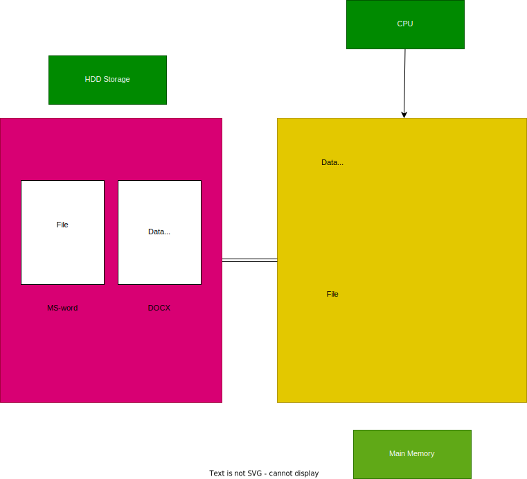
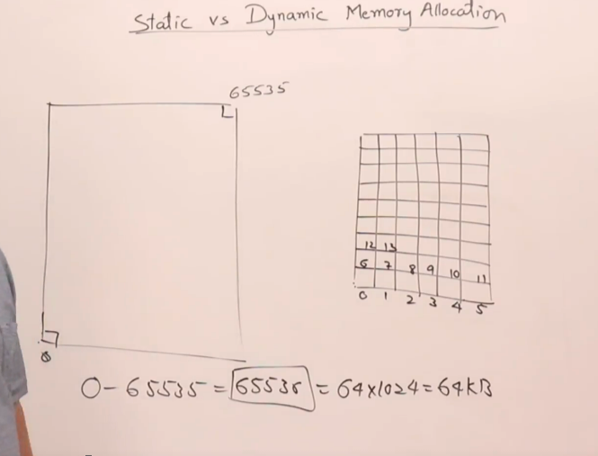
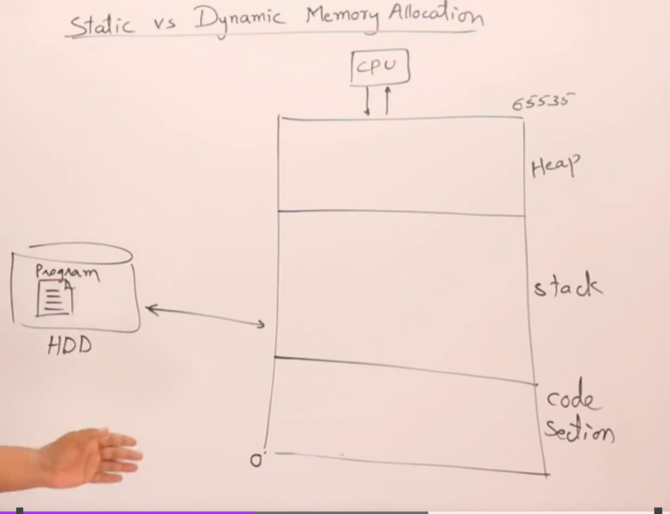
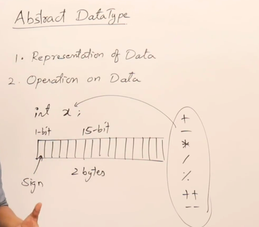
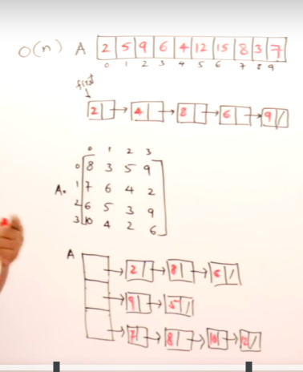

# Introduction to Data structures

What is a Data Structure?
A program is a set of instructions which perform operations on data. We need data without the data the program can't be executed.
How it'll organize the data in main memory during execution time is known as Data Structure

CPU

Data

Program Code

## list of data Structures

### Physical data structures ( arrangement )

- Arrays
- Matrices
- Linked List
  
### logical data structures ( utilization )

- Stack
- Queues
- Trees
- Graph
- Hashing

- Recursion
- Sorting

- Data structures
- Data bases
- Data warehouse
- Big  Data

## Data Structure

- Arrangement of collection of items so that operations can be done efficiently. Inside main memory during execution of program.
- During execution of a program. The complier will manage data in main memory called data Structure.
- A data structure is not only used for organizing the data. But, Also it is also used for processing, retrieving, and storing data.
- There are different types of basic & advanced types of data structures that are used in almost every program or software system that has been developed. So we must have good knowledge about data structures.

Example:



CPU     -> Central processing unit <br/>
Ram     -> Main memory <br/>
Storage -> External storage <br/>

- CPU will execute the instructions.
- Main memory also knows as temporary memory, Main memory that is working memory of the program code.
- Storage also knows as permanent storage. When we install a program / application they'll install in the storage as shown in HDD( HardDisk, SSD's ).

Example:

- If we have a docs file it'll be stored in the main memory. If we try to open the docs then the docs file will come to main memory.
- When ever we run any app it should be brought to main memory.
- When the app comes to main memory then the cpu will start to execute/process the program. We can see the window pop-up & the file will be opened.

## NOTE

- Not only files whenever we want to execute something like data it also should be bought to main memory & the cpu can perform required operations.

Example:

Why we need main memory?

- If we cook an omelette on pan will we eat the omelette on pan. No, We use a plate to eat it. In the same way to execute we need to get the data to main memory then the CPU will process the data & the result will be write backed to `storage`.
- The arrangement or organizing how the data resides in the main memory is called data structures.
- We have many data structures like arrays, trees, hash table.


## Data base

## Data warehouse

## Big data

## Stack VS Heap memory

### context

- About main memory
- How a program uses memory
- Static allocation
- Dynamic allocation

Memory is divided into bytes. Chunk of bytes makes memory/storage. Every byte has it's address in the memory to uniquely identify them from other.

- When ever we perform any operations & we use memory. The complier will assign the bytes for instance int occupies 4-bytes.
- In cpu the entire memory is divided into manageable pieces knows as segments. The size of segment is 64kb.



## Main Memory



## static memory allocation

- When ever the memory is allocated before run or compile time it's know as static memory allocation.
- When ever a program is runned the compiler will divide the memory into three parts `Code Section`,`Stack`,`Heap`. The code will reside in the code section & when we compile the program any data is assigned and stored in the stack.
- In the below example when we have declare int, float according the compiler 2/4 bytes are assigned to the integer. The storage is assigned in stack also know as stack form.


## Dynamic Memory Allocation


- In the above example we have a program in which we have written two functions fun1 & fun2 namely. It has main function `void main()`.
- When the compiler is initialized the main function the integer & float pointer will be stored in stack memory. When the  execution went to `fun1`. Then integer `x` is initialized & space is allocated. In the same way for the `fun2`.
- When `fun2` has been executed then the activation record will be deleted from the main memory.
- As the same way the activation record will be deleted as the program ends and the memory is cleared.
- First when the program is create the main function activation record is created & then for `fun1` the activation is created then for `fun2` it's created like a stack. So, it's named after stack.
- How much memory is required by a function is depends on number variables & size. This is decided by compiler which is automatically created & deleted. As a programmer we just need to declare the variable.

## Heap

- Heap means piling up like a hill.
- If the data in memory is not organized and dumped is known as heap.
- Heap is a not organized but stack memory is organized.
- Heap memory should be used like recourse ( `Recourse` : If we want to use printer. We'll access the printer and then release the printer so that other can use it, In the same way we use heap memory).
- The program will not access the heap memory. We need access them using pointer.

Example:

```c++
void main()
{
    int *p;
    p=new int[5]; /* In Cpp */
    //p=(int *)malloc(2 * 5);  in c language  

    delete []p;
    p=NULL;
}
```

- When ever we use heap memory. We need to de-allocate the memory. If not the memory will be saved & occupied in the memory. The next time when you use heap, there may be no space left.

## Physical Data structures

- How memory is allocated is decided by physical data structures
- Physical data Structures are used to stored the data in memory. We use them for insertion, deletion & searching.
- How to utilize the data in physical data structures are defined by logical data structures.

## Array

- If we know limit we use arrays else we need the memory to be allocated dynamically we go for linked list.

## linked list

- Always should be or are created in heap
- linked list are created dynamically

## Logical data structures

how we manage certain data on the physical data structure is called logical data structure. we use logical data structure are implement using physical data structure.

### Linear

- Stack  -> Last In First Out
- Queues -> First In First Out

### Non Linear

- Trees
- Graphs

### Tabular

- Hash Tables

This data Structure are used in applications. These logical data structures are implemented using physical data structures.

## Abstract Datatype

### What is a data type

Datatype is defined as

- Representation of Data
- Operation on Data

### Representation of Data

`int x;`

- If we consider `int` occupies 2bytes -> 16 bits of memory in c/c++.
- In that 16 bits 1bits is assigned to the sign i.e `+/-` & in the remaining 15 bits the number is stored. This is called Representation of data.

### Operations on data `int x;`

- Arthematic operations are allowed on the data like `+ , -, *, /, %, ++, --`

### Abstract

- Hiding internal details is known as abstract.
- As mentioned above we have representation & operations of data. Which are done internally so this is know as `Abstract DataType`.
  


Example:

List -> 8,5,4,3,2,5,11 <br/>
         0,1,2,3,4,5,6

- This is list which is collection of elements.
- We need data Representation:
  - Space for storing elements
  - Capacity
  - size

- Operations we perform:
  - add (x)
  - sub(x)

- Here we can either use arrays or linked list to store the elements.
- Define the data & the operations on data together & let it be used as data type by hiding all internal details. This is known as abstract DataType.

## Operations in List/Array

These are some operations that we use:

- .add(element)/append(element)
- .add(index,element)/insert(index,element)
- .remove(index)
- .set(index,set)/replace(index,element)
- .get(index)
- .search(key)/contains(key)
- .sort()

- There are more operations like concat, merge, reverse a list. etc..

## Time & Space complexity

### Time complexity

- The amount of time required to do a task is known as time complexity. This time required depends on the procedure we choose.

Example:



## 1. Array

- If we have an array of size(n) and we need to perform a operation like to add the elements in the list. It would take (n) time as we need add all the elements of the list.
- If we need to search for an element we need to go through all the elements in the list. This also takes $(n)$ time.
- We represent this $(n)$ as $O(n)$ i.e order $(n)$. The time required to perform a operation/task is $O(n)$.
- To access all the elements in the list we need to write a  `for-loop`. Which will go through the entire list `for(int i=0;i<n;i++)` the time complexity is order $(n)$.
- Based on the work we are doing or from the program code we can define/conclude what's the time complexity of the given program.
- If there is an `for-loop` which is going through all the elements. Then the time complexity is $O(n)$.

<br/>

## 2. Linked List

- In a linked list for each & every element we process all the elements then the time complexity is $O(n*n)$ -> $O(n^2)$.
- A simple way to find out time complexity is by checking the code. If we have nested for loop then the time complexity is $n^2$.

```c++
for(int i=0;i<n;i++>)
{
    for(j=0;i<z;j++>)
    {
        ------
        ------
    }
}
```

- In the above example of linked list we have use 2 for loops to go through the linked list. So, The time complexity is $O(n^2)$.

## 3. First & Rest

- Being on the first element and we process the rest of the elements. After wards moving the pointer to the second element and process the rest of elements $1+2+3....n-1$.

$$= n(n-1)/2 $$

$$= n^2-n/2$$

$$= n^2$$

$$ O(n^2)$$

- The time complexity is $O(n^2)$.

## 4. Diving the middle & process left of right side of elements

- If we divide a array in middle and process the left side or right side of elements. Then the time complexity will be $\log_{2} n$

## Matrix

- If we are processing matrix it'll take nXn which is $O(n^2)$
- If we process only a column then time complexity is $O(n)$

## Array of elements

- It required mXn elements $O(m+n)$
- Based on requirement or your consideration the time complexity will change.If we only choose n or m then the time complexity is $O(n)$

## Space complexity

- How much space is consider in main memory is known as `space complexity`
- The space complexity of an array is $O(n)$ as there are `n elements`.
- For a matrix the space complexity on $O(n^2)$, For array list in $O(m*n)$

## Analyzing code to find out time & Space complexity

- Every simple statement in function or program take a unit of time like arthematic operation, conditional statements, assignment.
- If the statements are more complex we need to further analysis the code.

### Example: Swap numbers

```c++
void swap(x,y)
{
  int t;
  t=x; - Statement ( assignment)
  x=y; - Statement
  y=t; - Statement
}
```

function(n) = 3 *n^0 - Here three is constant as 3*n^0
$O(1)$
$O(n^0)=O(n)$

### Example

```c++
int sum(int A[],int n)
{
  int s,i;
  s=0; - 1
  for(i=0,i<n;i++) - n + 1 actual is 2(n + 1) we write (n + 1)
  {
    s=s+A[i]; - n
  }
  return s; - 1
}
```

time functions $f(n) = 2n + 3$

$O(n)$

Example: 3

```c++
void Add(int n)
{
  int i,j;
  for(i=0;i<n;i++) - n + 1
  {
    for(j=0;j<n;j++) - n * (n + 1)
    {
      c[i][j] = A[i][j] + B[i][j]; n * n
    }
  }
}
```

Time function $f(n)= 2n^2 + 2n + 1

$O(n^2)$

- In the above code we have 2 for loops. So, First we consider for the first loop how much time is taken.
- Then consider for the second loop.

## Note

- Just don't consider the statements & decide the time function. We should also analyze the statements deep. So, we don't miss anything.

______END________________________
