# Recursion

## Course Content

- What is recursion
- Example of recursion
- Tracing recursion
- Stack used in recursion
- Time complexity
- Recursion Relation

## Recursions

- A function calling itself is called as recursion.
- Recursion is the process of repeating items in a self-similar way. In programming languages, if a program allows you to call a function inside the same function, then it is called a recursive call of the function.
- There must be a base condition to terminate the recursion else it'll go into infinite loop.

Example:

```C++
void recursion() {
   recursion(); /* function calls itself */
}

int main() {
   recursion();
}
```

Example:

- In the given program we are running a recursive function with a condition. Which will call itself when the condition is DOESN'T satisfy.
- Here first the program comes to the function with the values & then go to the conditional statements.

- As the value of `int x = 3`. The condition won't get satisfied & the program enter the condition. Then the value of `x` will be printed. Then the fun is called again with `(n-1)` => `fun(3-1)` => `fun(2)`. So, on until the value of `n = 0` program will be exits the function & perform any task after `fun()` call. The program will get terminated.
- Check the image below for tracing how does recursion works.

```c++
#include<stdio.h>

void fun(int n)
{
    if(n>0)
    {
        printf("%d\n",n);
        fun(n-1);
    }
}
    void main()
    {
        int x=3;
        fun(x);
    }
```

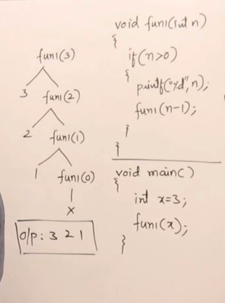

## Example:2

- This is the exact copy of the above program, But the only change is where we have used the `fun()` call.
- In this the function is declared before `print` statement. So, the tracing happens differently as shown in the picture.

- First the `fun` calls itself, Now the value have changed to `2`. So, the `fun` is called instead `printf` statement until the condition is satisfied. As, Shown in the image. Then after the condition is satisfied the `printf` statement will be executed.

```c++
#include<stdio.h>

void fun(int n)
{
    if(n>0)
    {
        fun(n-1);
        printf("%d\n",n);
    }
}
    void main()
    {
        int x=3;
        fun(x);
    }
```

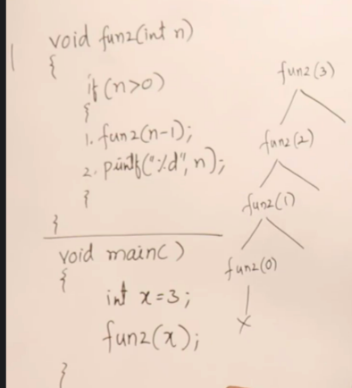

## Explaination of code: bulb

- The below example explain how the tracing is done. In the above program.
- Here we have to statement
  1. switch on bulb
  2. Goto next room

- First when we enter a room we'll turn on light then proceed to next room & vise versa until we reach last room.

- Second statement
  1. Goto next room
  2. Switch on light
- Here first we'll enter room 1. Then instead of switching on the light. We'll go to next room until we reach the end.
- After reaching the end the second condition of switching on light is implemented till he reaches the exit.

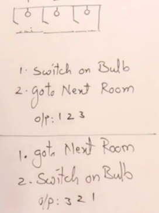

- The same way as the bulb example the above program is executed.

```c++
#include<stdio.h>

void fun(int n)
{
    if(n>0)
    {
        printf("Testing 1.0\n");
        fun(n-1);
        printf("Testing 2.0\n");
        printf("%d\n",n);
        printf("Testing 3.0\n");
    }
}
    void main()
    {
        int x=3;
        fun(x);
    }
```

- Execute the above program to understand how does tracing works if we declare the function above `print` statement.

## Generalising recursion

- In the given example program we have written a simple recursion function.
- When will the first line get execute. Its executed while calling time.

- The 3 line will be executed at returning time. Checkout the above example.
- This statement are ascending & descending respectively.
- Recursion are same like looping statements but looping statements only have ascending where as recursion have ascending as well as descending.

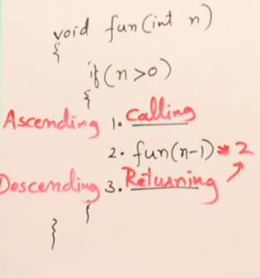

## Recursion using stack

- Recursive funtions are memory consuming functions.
- As shown below. When the program is executed the code is saved in the code_section. The values are stored in the stack.
- When the program starts to execute then `int x=3` activation record is stored in the stack first, Then the program goes to the function with the value of `x` i.e `fun(3)`.

- Now the program control is at function which took `x` as argument with `n=3`. A activation record is created for n in the stack.
- Then the function moves to the conditional statement. The statement is not satisfied then the program will enter the conditional statement then the function will call itself with the value of `n=2` then activation record is created for this & stored in the stack.
- The above process continues until the value become `n=0` when the `if` condition is satisfied the program come to the `print` statement and `prints` `1`. Then the activation record is deleted.
- This process is continued until the value is `3`. Then the program will exit.

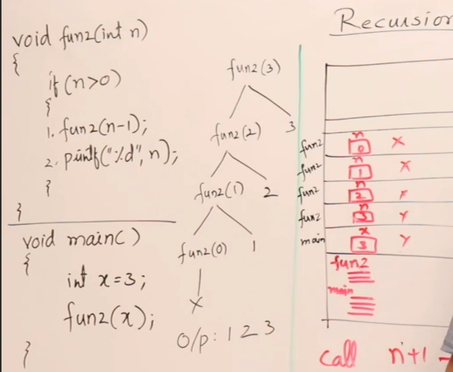

Example:2

- This program also follows the same procedure. It has a additional feature of printing the element.

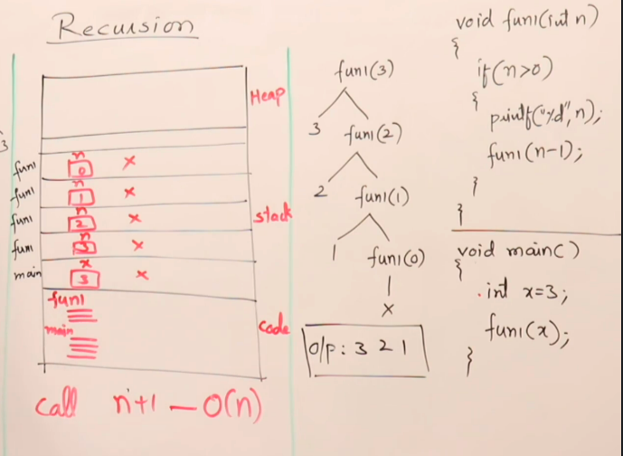

## Time complexity

- The time complexity is $O(n)$

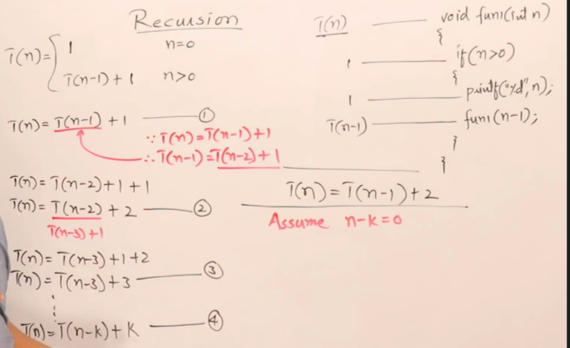

## RAND

- In the below code tracing shown. We have written a recursive function.

```c++
#include<stdio.h>

int fun(int x){
    if(x>0)
    {
        int a=fun(x-1)+x; 
        printf("%d\n",a); /* will show the values a */
        return a;
    }
    return 0;
}

void main()
{
    int a=5;
    int b = fun(a);
    printf("Final output: %d\n",b);
}
```

```output
1
3
6
10
15
Final output: 15
```

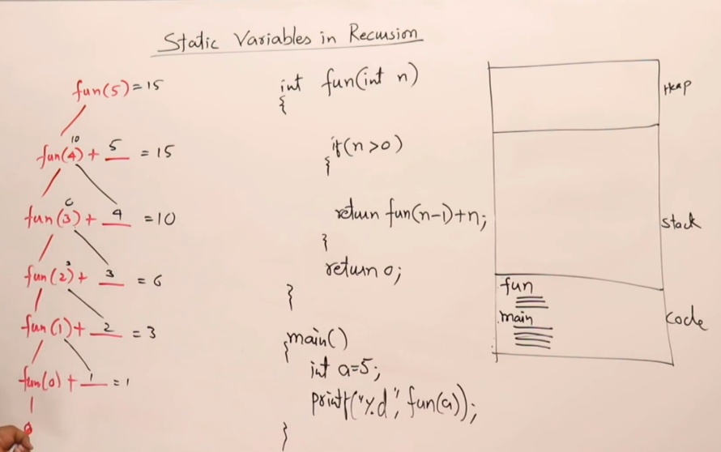

## Static and Global Variable in Recursion

- A stack is created as , for every call each time a new variable will be created inside the memory and it'll have its value this is also know as local variable of a function

- If static variables are inside recursive function don’t show them in each tracing tree write them in global or outside
variable and maintain a single copy of it

- Static variable are stored in code section. They have a sub-section to store static & global variables.

- Unlike other values i.e in the above example n has multiple activation records. Static & global variables don't have multiple activation records. But only have one & the only record is update as shown below image.

```c++
#include<stdio.h>

/* int x=0 global variable */

int fun(int x){
    static int z;
    if(x>0)
    {
       z++;
       return fun(x-1)+z;
    }
    return 0;
}
void main()
{
    int a=5;
    int b = fun(a);
    printf("testing: %d\n",b);
}
```

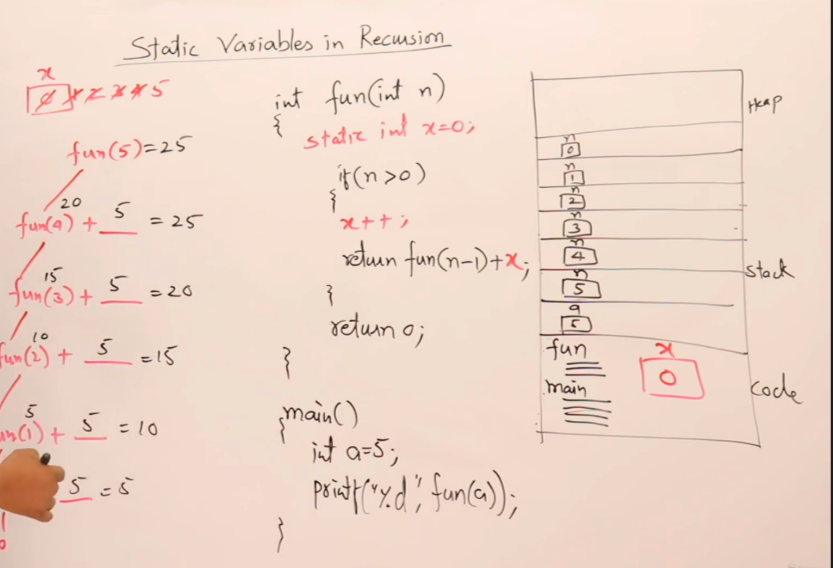

## Types of recursion

- Tail recursion
- Head recursion
- Tree recursion
- Indirect recursion
- Nested recursion

## Tail Recursion

- If a recursive function is calling itself and that recursive call is the last statement in a function then it is called as tail recursion.
- After that call it will not perform any task.
- All the function will be performing on the calling time itself
- If there is some function that need to be performed after its returning time then it is not a tail function

```c++
#include<stdio.h>

void fun(int n)
{
    if(n>0)
    {
        printf("%d\n",n);
        fun(n-1);        /* tail function */
    }
}
    void main()
    {
        int x=3;
        fun(x);
    }
```

## Tail Recursion v/s loops

- Tail recursion can easily converted into loops as its structure and syntax is almost same
- In term of time taken by both is same 0(n)
- Space taken by tail is 0(n) where as the space for loops is 0(1)
- To conclude, If you are using tail recursions its better to convert it into loop as the space used is less

```c++
#include<stdio.h>

void fun(int n)
{
    while(n>0)
    {
        printf("%d",n);
        n--;
    }
}
void main()
{
    fun(a);
}
```

- Which one is more reliable in both programs as they both perform same task.
- In case of tail recursion is time complexity is $O(n)$ but for loop its $O(1)$. Tail recursion used more memory in stack. So, its better use loops in place of tail recursion.
- In some core compilers the tail recursions is converted into loops as it consumes less space.

## Head Recursion

- Here the first statement inside the function is recursive call and all the processing of this function will be done after that in head recursion the function doesn't have to process any operation at the time of function calling it has to do everything at the time of returning such functions are head recursion

## Head Recursion to Loop

- Although it is possible but It is difficult to convert head recursion into a loop function
- Head recursion can't be easily converted as it is in loops. As the process is done at returning time. It can't be converted easily but can be converted

```c++
#include<stdio.h>

void fun(int n)
{
    if(n>0)
    {
        fun(n-1); 
        printf("%d\n",n);               
    }
}
    void main()
    {
        int x=3;
        fun(x);
    }
```  

## Tree Recursions

- If a function calls itself multiple times its knowns as tree recursion. As shown as given code below.

- If there's is only a single function call its called linear recursion.
- As shown in the below syntax below.
- In linear recursion the function is defined in between. There are instructions that should be executed before & after the function declaration.

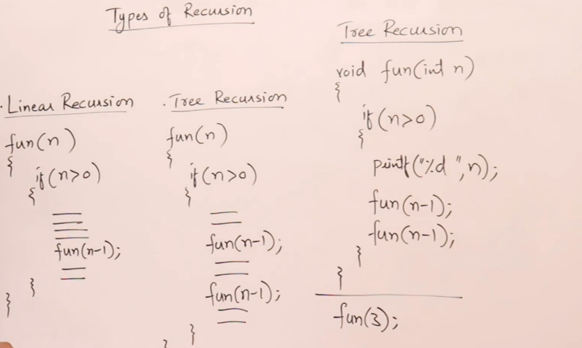

Example:

- The below program shows tree resursion. Where we use two `fun` calls.
- This explains how the data it stored & deleted in stack.

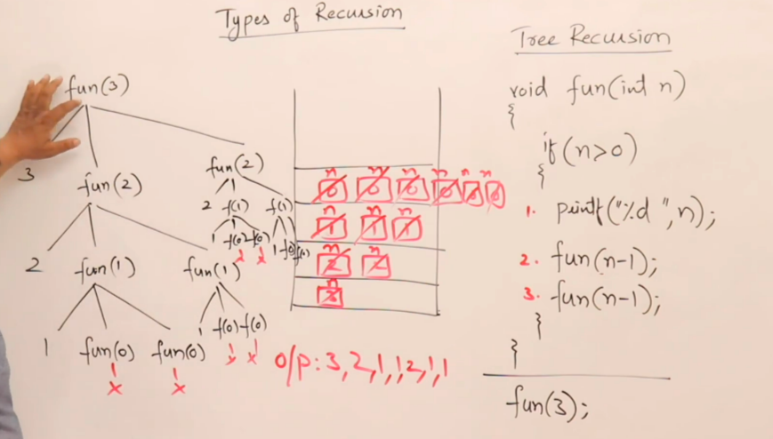

- This is tracing of tree recursion

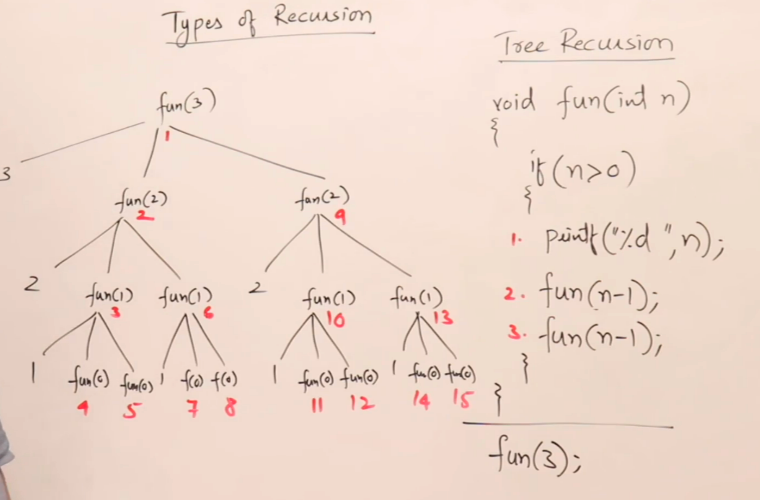

- The time complexity is $O(2^n)$
- Time complexity will be equal to the height of the tree $O(n)$

## Indirect Recursion

- Indirect recursion is when a two or more programs calls them selfs in a circular manners is known as Indirect recursion.

```c++
#include <stdio.h>

void funB(int n); /* Errors 1.0*/
void funA(int n)
{
 if(n>0)
 {
 printf("%d ",n);
 funB(n-1);
 }
}
void funB(int n)
{
 if(n>1)
 {
 printf("%d ",n);
 funA(n/2);
 }
}
int main()
{
 funA(20);
 return 0;
}
```

## Error 1.0

- Here we have declared the `funB` before `funA` cause. We are using `funB` before its created/define. So, if we create a functions before `funA`. We won't get an error.

## Nested Recursion

- A recursive function will pass parameter as a recursive call is called nested recursion
- A recursive function taking recursive call as its parameter is called nested recursion

Example :

```c
#include<stdio.h>

int fun(int n)
{
 if(n>100)
 return n -10;
 else
 return (fun(fun(n+11)));
}
int main()
{
    printf("%d",fun(95));

    return 0;
}
```

## Tracing

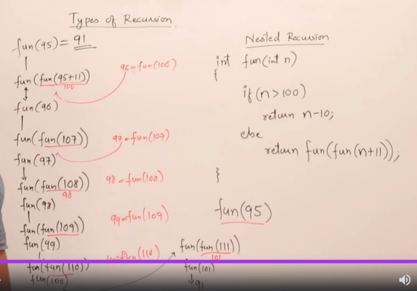

## Coding Practice

### Sum of natural number

```c
#include<stdio.h>

int sum(int n)
{
 if(n==0)
 return 0;
 return sum(n-1)+n;
}
// OTher methods
// int Isum(int n)
// {
//  int s=0,i;
//  for(i=1;i<=n;i++)
//  s=s+i;

//  return s;
// }
// int sum(int n)
// {
//     return n *(n+1)/2;
// }
int main()
{
 int r=sum(5);
 printf("%d ",r);
 return 0;
}
```

### Factorial number

```c
#include<stdio.h>

int fact(int n)
{
 if(n==0)
 return 1;
 return fact(n-1)*n;
}
int Ifact(int n)
{
 int f=1,i;
 for(i=1;i<=n;i++)
 f=f*i;

 return f;
}
int main()
{
 int r=Ifact(5);
 printf("%d ",r);
 return 0;
} 
```

### Exponential

- Here we are calculating the exponentials $(m)^n$. We need find the power of the given variables.


### Optimizing exponentail

- If we divide the the exponential then the number calculations will be reduced & we can achive time complexity.

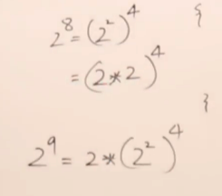

## Code

```c
#include<stdio.h>

/*
int power(int m,int n)
{
 if(n==0)
 return 1;
 return power(m,n-1)*m;
}*/

int power1(int m,int n)
{
 if(n==0)
 return 1;
 if(n%2==0)
    return power1(m*m,n/2); // for even numbers
 return m * power1(m*m,(n-1)/2); // for odd numbers
}

int main()
{
 int r=power1(9,3);
 printf("%d ",r);
 return 0;
}
```

## Taylor Series using Static variables

$$e^x= 1 + \frac{x}{1} + \frac{x^2}{2!} + \frac{x^3}{3!} + .... + n-terms$$

```c
#include<stdio.h>

double e(int x, int n)
{
 static double p=1,f=1;
 double r;

 if(n==0)
 return 1;
 r=e(x,n-1);
 p=p*x;
 f=f*n;
 return r+p/f;
}

int main()
{
 printf("%lf \n",e(4,15));
 return 0;
}
```

## Taylor Series Horner’s Rule

```c
double e(int x, int n)
{
 static double s;
 if(n==0)
 return s;
 s=1+x*s/n;
 return e(x,n-1);

}
int main()
{
 printf("%lf \n",e(2,10));
 return 0;
}
```

## Taylor Series Iterative

```c
#include <stdio.h>
double e(int x, int n)
{
 double s=1;
 int i;
 double num=1;
 double den=1;

 for(i=1;i<=n;i++)
 {
 num*=x;
 den*=i;
 s+=num/den;
 }
 return s;
}
int main()
{
 printf("%lf \n",e(1,10));
 return 0;
}
```

## Sin series expansion

```c++
#include <iostream>

using namespace std;

double sine(double x, int n)
{
static double num=x,den=1,sign=1;
double sum;
if(n==0)
return 0;
if(n==1)
return x;
else{
sum=sine(x,n-1);
num=num*x*x;
den=den*(2*n-2)*(2*n-1);
sign=sign*-1;
return sum+(num/den*sign);
}
}

int main() {
cout <<sine(90*3.14/180,40);
return 0;
}
```

## Fibonacci Series

```c
#include <stdio.h>
int fib(int n)
{
 int t0=0,t1=1,s=0,i;

 if(n<=1) return n;

 for(i=2;i<=n;i++)
 {
 s=t0+t1;
 t0=t1;
 t1=s;
 }

 return s;
}
int rfib(int n)
{
 if(n<=1)return n;
 return rfib(n-2)+rfib(n-1);
}

int F[10];
int mfib(int n)
{
 if(n<=1)
 {
 F[n]=n;
 return n;
 }
 else
 {
 if(F[n-2]==-1)
 F[n-2]=mfib(n-2);
 if(F[n-1]==-1)
 F[n-1]=mfib(n-1);
 F[n]=F[n-2]+F[n-1];
 return F[n-2]+F[n-1];
 }
}

int main()
{
 int i;
 for(i=0;i<10;i++)
 F[i]=-1;

 printf("%d \n",mfib(5));
 return 0;
}
```

## Combination Formula

```c
#include <stdio.h>

int fact(int n)
{
 if(n==0)return 1;
 return fact(n-1)*n;
}

int nCr(int n,int r)
{
 int num,den;
 num=fact(n);
 den=fact(r)*fact(n-r);

 return num/den;
}

int NCR(int n,int r)
{
 if(n==r || r==0)
 return 1;
 return NCR(n-1,r-1)+NCR(n-1,r);

}
int main()
{
 printf("%d \n",NCR(5,3));
 return 0;
}
```

## Tower of Hanoi

```c
#include <stdio.h>
void TOH(int n,int A,int B,int C)
{
 if(n>0)
 {
 TOH(n-1,A,C,B);
 printf("(%d,%d)\n",A,C);
 TOH(n-1,B,A,C);
 }
}

int main()
{
 TOH(4,1,2,3);
 return 0;
}
```
