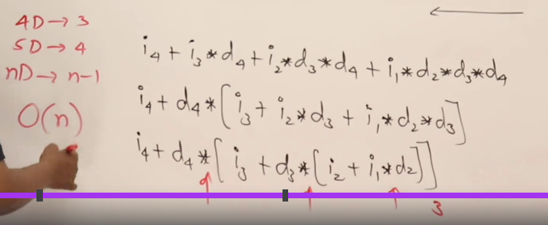

# Array Representation

## Course Content

- What is an array
- Declaration & initializing
- Accessing arrays

## Arrays

- Array is a collection of similar data types grouped under one name
- Its also called vector value
- We can Access or differentiate all the elements in an array using index values
- This concepts is supported by many programming languages

## Example

```c
int A [ 5 ]; // Initialize or declaration
A[ 2 ] = 15; // Access
```

- Some ways of Declaring and initialization of array are as follows
- if you have given the size of the array and only give 1 or 2 values the remaining values will be initialize with `0`.

int A[ 5 ] ; </br>
int A[ 5 ] = {2,4,6,8,10};</br>
int A[ 5 ] = {2,4};</br>
int A[ 5 ] = {0};</br>
int A[ ] = {2,4,6,8,10};</br>

- To access all elements in an array, we can traverse through it for example.

```c
int A[ 5 ] = {2,4,6,8};
for (i = 0; i < 5 ; i++)
{
printf( “%d”, A[ i ] );
}
```

- The elements inside the array can be access through the subset or through the pointer

```c
int A[ 5 ] = {2,4,6,8};
for (i = 0; i < 5 ; i++)
{
 printf( “%d”, A[ i ] );
 printf( “%d”, A[ 2 ] ); // Example of accessing elements inside an array
 printf( “%d”, 2[ A ] ); // Other method to access the element
 printf( “%d”, *(A + 2 ) ); // using the pointer method to access the element
 printf( "%u \n",&A[ i ]); // To print the address of the elements.
}
```

## Static Vs Dynamic Arrays

- Static array means the size of an array is static I.e; fixed
- Dynamic array means the size of an array is Dynamic I.e; flexible
- When an array is created it is created inside Stack memory & once it's created in stack memory the size cannot be modified.
- The size of the array is decided during at compile time
- When declaring an array it must be a static value only and not variable type in c language. However in c++ dynamic allocation is possible during compile time
- We can create array inside Heap
- When accessing any value inside a heap it must be done through a pointer
- The int P stores the address of the memory which is allocated in heap memory. For example in heap we got assign an address `123`. The pointer *p which is stored in stack memory stores the address `123` and access the heap memory through this.

Example :

```c
Void main( )
{
int A[5];
int *p;
// p = new int[5]; cpp
p = ( int * ) malloc ( 5 * sizeof( int ) ); // C
....... // perform a
.......
}
```

- When the work in heap is done it must be deleted or it will cause [memory leak](https://github.com/Hello-Ship-Code/The-beginning-PC-) which will cause problems.
- To release the heap memory we do.

```c
- c++ delete[ ] p;
- C lang free( p );
```

## Static vs Dynamic Arrays

```c
#include <stdio.h>
#include <stdlib.h>
int main()
{
    int A[5]={2,4,6,8,10};
    int *p;
    int i;

    p=(int *)malloc(5*sizeof(int)); 
    // p = new int[5];
    p[0]=3; // accessing 
    p[1]=5;
    p[2]=7;
    p[3]=9;
    p[4]=11;

    for(i=0;i<5;i++)
    printf("%d ",A[i]);

    printf("\n");
    for(i=0;i<5;i++)
    printf("%d ",p[i]);

    return 0;
}
```

## How to increase Array Size

- An array is created in stack, so in order to increase the array size we can use another pointer of larger size then point it to the array this will transfer all the elements to the new array
- After allotting the array to the new pointer it a must to delete the previous pointer so that there is no memory leakage.
- The command use to delete is delete[ ].

## Array Size

```C
#include <stdio.h>
#include <stdlib.h>
int main()
{
    int *p,*q;
    int i;
    p=(int *)malloc(5*sizeof(int));
    p[0]=3;p[1]=5;p[2]=7;p[3]=9;p[4]=11;

    q=(int *)malloc(10*sizeof(int));

    for(i=0;i<5;i++)
    {
        q[i]=p[i];
    }
    

    free(p);
    p=q;
    q=NULL;

    for(i=0;i<5;i++)
    {
        printf("%d \n",p[i]);
    }
    

    return 0;
}
```

## 2D Array

- In programming language it is possible to create multi dimensions arrays
- One of the common multi dimensions array is 2D array this is used to implement matrices

- They are 3 methods of declaring 2D arrays
- We can access 2D array using 2indices (one for row and other for column)

## Normal Declaration

`Int A[ 3 ][ 4 ];`

- Memory will be created like a single dimension array , but compiler will allow us to access that array as a 2D arrays with rows and columns
- We can directly mention the array list and initialize it.

- Ex: `int A[3][4] = { {1,2,3,4} , {2,4,6,8} , {3,5,7,9}}`
- It is partial is stack

## Array Of Pointers

```c
int * A[ 3 ] ;
A[0] = new int[ 4 ];
A[1] = new int[ 4 ];
A[2] = nwq int[ 4 ];
```

- The pointer will be created inside heap memory and through that we can access, initialize and declare all the elements inside the array
- This is array of integer pointer
- It is partial in Heap

## Double Pointer

- Here almost everything is inside the heap pointer
- Here the pointer will be like a variable there is no new operator so it is
created inside stack in the memory

```c
int **A;
A = new int * [3]
A[0] = new int[ 4 ] ;
A[1] = new int[ 4 ] ;
A[3] = new int[ 4 ] ;
```

- Here everything is inside heap.

```c
#include<stdio.h>
#include<stdlib.h>

int main()
{
    int A[3][4] = { {1,2,3,4}, {5,6,7,8}, {9,10,11,12}};
    int i,j;

    for(i=0;i<3;i++)
    {
        for(j=0;j<4;j++)
        {
            printf("%d ",A[i][j]);
        }
        printf("\n");
    }
    printf("Stack and heap allocation\n");
    int *B[3];// Created in stack

    //B = new Int(4);
    B[0] = (int *)malloc( 4*sizeof(int)); // Created in heap
    B[1] = (int *)malloc( 4*sizeof(int));
    B[2] = (int *)malloc( 4*sizeof(int));
    // Accesing the data
    for(i=0;i<3;i++)
    {
        for(j=0;j<4;j++)
        {
            printf("%d ",B[i][j]);
        }
        printf("\n");
    }
    printf("heap allocation\n");
    int **C; // The Entire thing is created in heap
    C =  (int **)malloc(3*sizeof(int *));
    C[0] = (int *)malloc( 4*sizeof(int));
    C[1] = (int *)malloc( 4*sizeof(int));
    C[2] = (int *)malloc( 4*sizeof(int));
      // Accesing the data
    for(i=0;i<3;i++)
    {
        for(j=0;j<4;j++)
        {
            printf("%d ",C[i][j]);
        }
         printf("\n");
    }

    return 0;
}
```

## Array in Compilers

- Any location in an array can be accessed with the help of base address

Example: int A[ 5 ] = { 3,5,8,4,2 }

- The formula used by any compiler to convert it is

$$Addr( A[ i ] ) = Lo + i * w$$

 Lo - Base address
 i  - Index we need to access
 w  - Size of Data Type ( int, float..etc)

- Base address of an array will be updated when the program starts running and once the memory is allocated
- So the address of this is known during run time
- As the base address is relative the formula for it is also relative
formula
- Suppose a in a different language if the index value starts from 1
then the formula for the compiler is as follows

$$Addr( A[ i ] ) = Lo + ( i - 1 )* w$$

## Row Major Formula for 2D Arrays

- In compiler a 2D array is in linear form ( 1D Array ) in terms of down  and column.
Checkout the [Row Major](./PDF/RowMapping-89.pdf) for better understanding.

$$Addr( A[ i ][ j ] ) = Lo + [i*n+j] *w$$

Note:

- In some compliers the index will be starting from `1` rather than `0`. For that the address calculation will be different & it consumes more time. So, Mostly we don't see indices starting from `1`.

$$Addr( A[ i ][ j ] ) = Lo + [ (i-1)*n+(j-1)] *w$$

- Here the time complexity increases as there are more calculation need to be performed.

## Column Major Mapping

- Here the elements of array are stored in column by column. Checkout the [column Major](./PDF/ColumnMajorArray-90.pdf) for better understanding.

$$addr( A[ i ][ j ] )= Lo + [ j * m + i] * w $$

## Formula for nD Array

Example: Type A[d1] [d2] [d3] [d4]

### Row Major for 4D array

$$Add( A[ i1 ] [ i2 ][ i3 ] [ i4 ] ) = L0 + [ i1 * d2* d3 * d4 + i2 * d3 * d4 + i3 * d4 + i4 ] * w$$

- The time complexity is $O(n^2)$.



- Here we have use honer's rule to optimize the program.

### Column Major

$$Add( A[ i1 ] [ i2 ][ i3 ] [ i4 ] ) = L0 + [ i4 * d1 * d2 * d3 + i3 * d1 * d2 + i2 * d1 + i1 ] * w$$

Note

- Row major is done from left to right.
- Column major is done from right to left.

## Formula for 3D Array

Example: int A[ l ] [ m ] [ n ] ;

Row Major: $$Addr ( A[ i ] [ j ] [ k ] ) = L0 + [ i * m * n + j * n + k ] * w$$

Column Major: $$Addr( A[ i ] [ j ] [ k ] ) = L0 + [ k * l * m + j * l + i ] * w$$

-- END --
